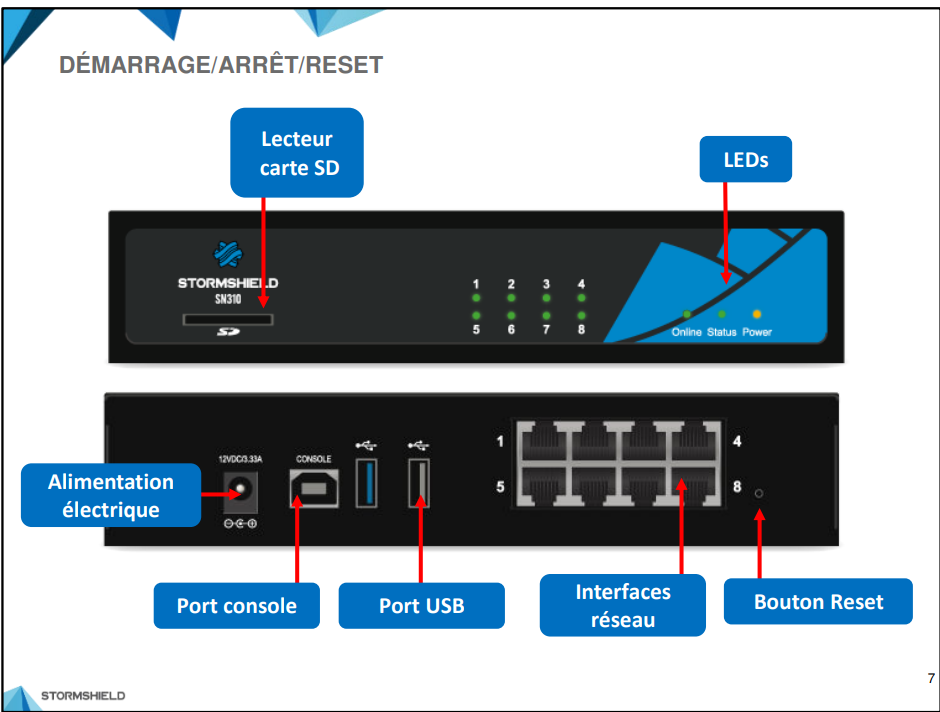
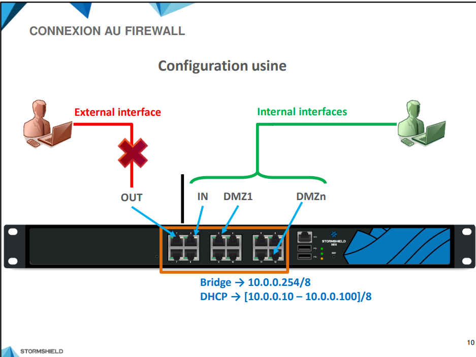
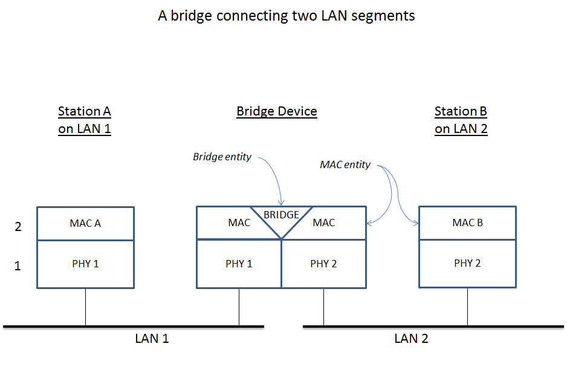
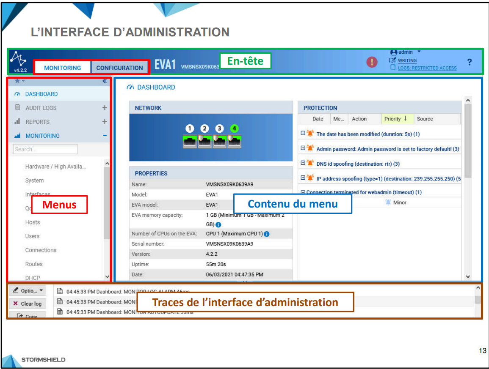
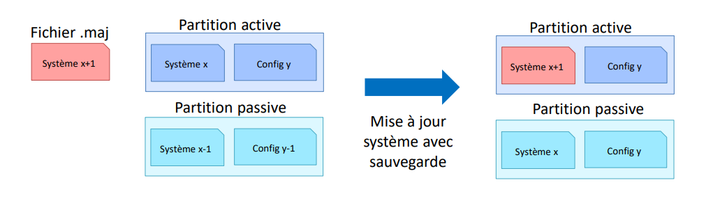
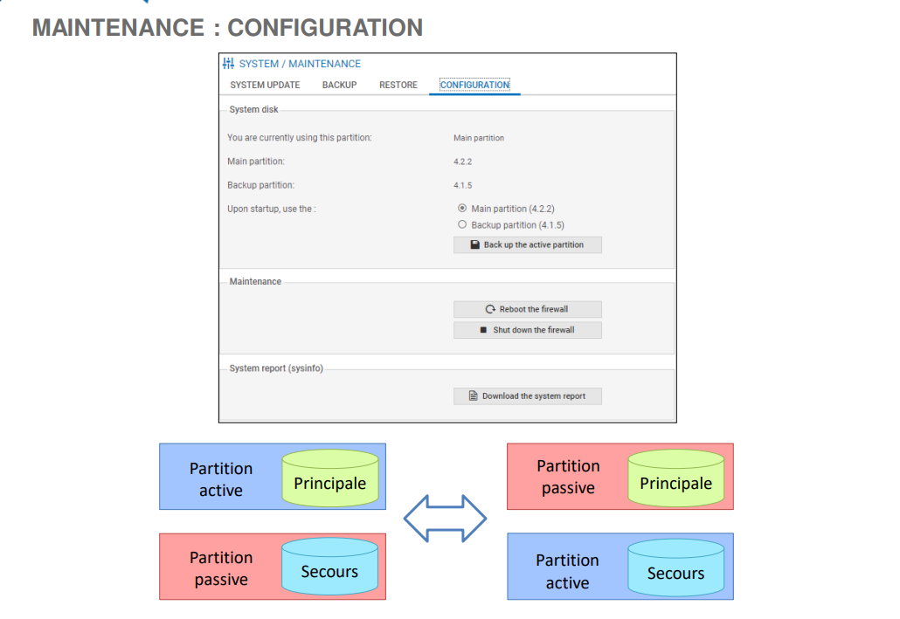
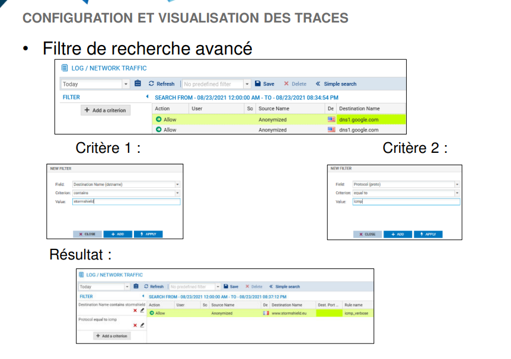
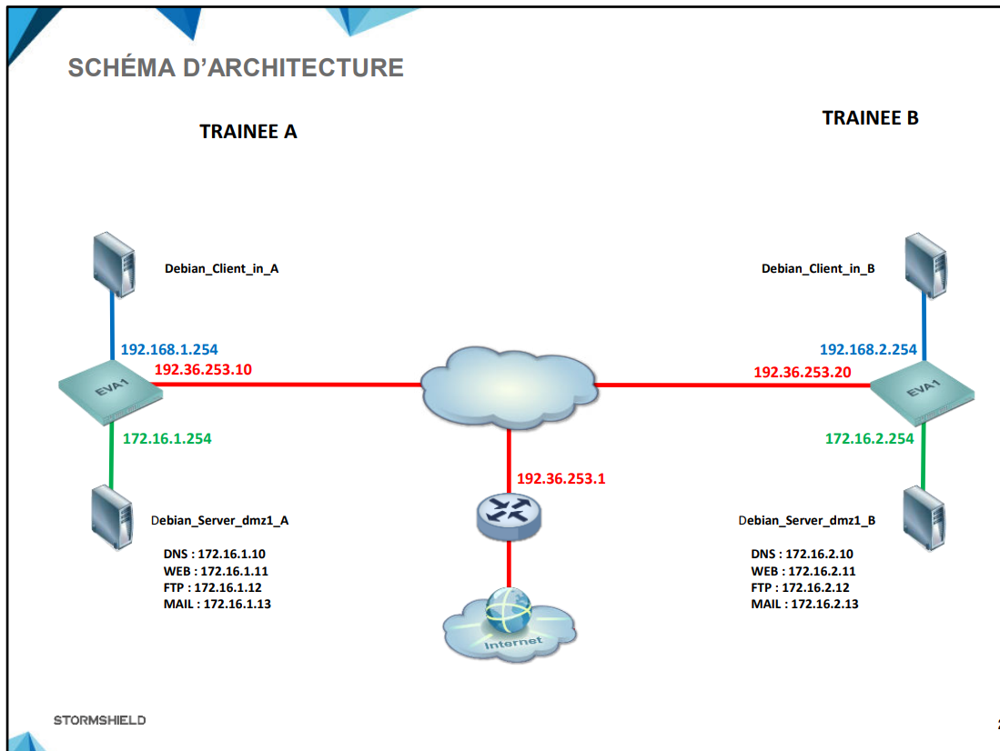
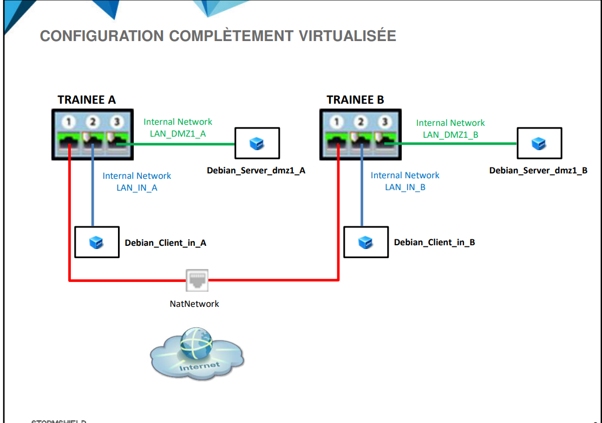

# StormShield

## I - Firewalls

### Petite Entreprise

- SN160(w)

- SN210(w)

- SN310

### Moyenne Entreprise

- SN510

- SN-M-SERIES-720

- SN-M-SERIES-920

### Grand-comptes

- SN1100

- SN2100

- SN3100

- SN6100

### Industrie

- SNi20 & SNi40

Utilisation des protocols industriels (Profinet, Modbus..).

Rupture Tolerant (Rigide, electricity independent).

- SNxr1200

Résistance à condition extemes (température -40 -> 55 , haute pression)

Respet standard militaire.

### Appliances Virtuelle

- Elastic Virtual Appliance

s'intégre dans l'hypervideur.

peut etre hebergé aussi dans les services cloud (microsoft Azure, AWS)

> les versions avec LTSB means supported for the long term.

## Administration centralisé

- Stormshield Management Center (SMC) 

Permet l'administration d'un parc complet de Firewalls StormShield.

Permet le deploiement des scripts, vpn sec, objets globaux, filtrage, surveillance des firewalls (licenses, ressources..).

## Fonctions standard

- IPS : Intrusion prevention system

- Signature contextuelles IPS : Une base de signatures d'attaque utilisé avec IPS pour renforcer les sécurité

- Antispam

- Antivirus standard

- Filtrage URL

- Systeme : 
    * raid 1
    * Double partion systeme (principale et secours)
    * Haute disponibilité

> stockage est natif dans l'ensemble des produits excepté pour les `SN160(w), SN210(w) et SN310`.

## Pack Sécurité

les différents packs sont : 

- Remote Office Security Pack: Protection des petis sites distants, connecté par un tunnel VPN.

- UTM Security Pack : bénifice IPS unique de stormsheil Network Security + antispam ...

- Premium UTM Security Pack : entreprises exigeantes en matière de securité.

- Entreprise Security Pack: concentre sur les fonctionnalités Next-Genneration Firewall.

Après le choix d'un pack, on peut ajouter les services suivants:

- Stormshield Network Vulnerability Manager

- Antivirus Avancé

- Filtrage Web Extended Web Control

- Stockage des log sur la carte SD

- Breach Fighter : Permet d'effectuer dans le Cloud une analyse complémentaire à celle de l'antivirus avanc", pour bloquer des attaques élaborées, avec le soutien d'une équipe de sécurité dédiée

## Prise en main du firewall

il existe deux comptes sur `https://mystormshield.eu/` : 

- Compte client : permet d'enregistrer l'ensemble des produits Stormshield d'une meme entreprise.

- Compte partenaire: permet des gérer l'infogérence éventuelle de comptes clients.

> L'infogérance1 est la prise en charge contractuelle, par un prestataire extérieur, d'une partie ou de la totalité des ressources informatiques d'une entreprise.

sur le site on peut:

- télécharger les licences.
- Récupérer des fichiers de conf.
...

pour le documentation : ` https://documentation.stormshield.eu`.

pour la knowledge base : ` https://kb.stormshield.eu`.

## Les composants du firewall StormShield

- Button démarage/arret

- Trois LED :
    * orange : firewall sous tension
    * verte : systeme d'exploitation du firewall est fonctionnel
    * verte : firewall a fini de démarrer et qu'il est fonctionnel.
- Post clavier PS2 + VGA/HDMI

> carte mémoire doit etre au minimum de class 10.

Le démarage/arret du firewall se fais en cliquant sur le button de démarage/arret.

Maintenir sur le button Rest pour 10s pour le reset.

## Configurer le firewall

> A partir de l'interface (0,0) aka top left, la premiere interface s'appelle OUT, le deuxieme IN, la troisieme DMZ1 -> DMZn

L'interface OUT est une inteface externe utilisé pour se connecté à l'internet.

les autres sont internes et servent principalement à connecter le firewall à des réseau locaux.

### le bridging:

Routing allows multiple networks to communicate independently and yet remain separate, whereas bridging connects two separate networks as if they were a single network.

> le bridge à une adresse IP 10.0.0.254/8 + il contient un serveur DHCP, il distribue des adresse comprisent entre 10.0.0.10 - 10.0.0.100

la connection vers l'interface graphique d'administrqtion est `https://10.0.0.254/admin`

par default : 
    - login : **admin**
    - password : **admin**

## L'interface d'administration

## Confirguration Système

Accessible par : CONFIGURATION -> SYSTEME -> Configuration.

### Configuration générale

- Les paramètres cryptographiques regroupent deux options qui sont
respectivement en relation avec les certificats (présentés dans la formation
Expert) et le mode « ANSSI Diffusion Restreinte (DR) ».

La politique de mots de passe définit la longueur minimale et les caractères
obligatoires des mots de passe créés dans les différents menus du firewall (par
exemple : mots de passe des utilisateurs dans l’aŶŶuaiƌe interne (LDAP), mots de
passe qui protègent les fichiers de sauvegarde, mots de passe des certificats créés
au niveau du firewall).

### Administration du firewall

- on peut modifier la certificat SSl de l'interface de configuration.

- on peut modifier le port par défaut (443/TCP).

- on peut configurer le delai max d'inactivité

- on peut activier la defence contre l'attaque bruteforce contre l'interface administrateur.

- on peut limité l'acces à l'interface d'administration à une machine ou un réseau spécifique.

- use the nsrpc shell for administrators other than the admin account : dans le cas ou on a un annuaire dans le réseau, on peut donner au utilisateurs le droits d'acces à la console en SSH.

### Parametre réseau

IPV6 est désactivé par défault, on cas d'activation seul un `reset` peut l'enlever.

## Modification du mot de passe du compte <<admin>>

> CONFIGURATION ⇒ SYSTÈME ⇒ Administrateurs, un minimum 5 caractère et doit respecter la politique de mot de passe définie dans le ,enu de CONFIGURATION

les button exporter la clé publique et la clé privé du compte admin permettent de se conencter en SSH au firewall.

## License

> CONFIGURATION ⇒ SYSTÈME ⇒ Licence 

la license par défaut est valide pour 3 mois seulement.

il faut installer une license depous l'espace privé StormShield.

## Maintenance

> CONFIGURATION ⇒ SYSTÈME ⇒ Maintenance

### 1 - Mise à jour le système

il faut installer le ficher `.maj` / appuier sur recherche des nv maj

### 2 - Sauvegarde

récuperer un ficher de sauvegarde de l'état du firewall `.na`.

les élements sauvegardé : 
- Réseau (interface, routage et DNS dynamique),
- Filtrage SMTP,
- Filtrage URL,
- Filtrage SSL,
- Objets web,
- Modules globaux,
- Configuration sécurisée,
- Active Update,
- Services (SNMP, serveur DHCP),
- Profils d'inspection IPS,
- Objets réseaux,
- Filtrage et NAT,
- VPN IPSec,
- Annuaire LDAP.

un sauvegarde partiel ne peux se faire qu'avec la ligne de commande.

le fichier de sauvegarde peut etre securisé par un MDP.

#### Sauvegarde automatique

- Cloud backup : géré par StormShield, le sauvegarde peut se faire chaque jour, chaque semaine, chaque mois

- Serveur Personnalisé : 
    * on peut configurer le port du serveur.
    * le protocol de communication.
    * Certificat de serveur.
    ...

### 3 - Restaurer 

se fait avec le fichier `.na`

on peut réstaurer le tout ou les parties qui nous intéressent :

> configuration avancée => sélectioner le ou les modules nécessaires => redémarage du firewall

on peut faire aussi le sauvegarde à partir de la dernière sauvegarde automatique dont la date est indiquée.

### 4 - Configuration

> UTM:  Unified Threat Management, refers to a comprehensive security solution that integrates multiple security features and functions into a single platform.

l'administrateur peut sélectionner la partition qui deviendra active au prochain
démarrage du firewall (principale ou de secours). Automatiquement l’autƌe partition
deviendra la partition passive.
Le bouton « sauvegarder la partition active » permet de copier tout le contenu de la
partition active (configuration + firmware) sur la partition passive.

> CONFIGURATION ⇒ SYSTÈME ⇒ Active Update

permet le controle des mise a jour automatique des modules : Antispams, IPS, Antivirus...

on peut aussi modifier les listes des serveurs de mise a jour. (configration avancée). 

le protocol utilisé pour la maj est soir HTTP ou HTTPs, en cas de l'HTTPS, il faut ajouter la CA du serveur pour pouvoir valider le certificat présenté.

> Serveur NTP : serveur de temps, network time protocol.

le serveur SSH se fait avec le compte admin par défaut et peut étre octroyé a des administrateurs supplémentaire.

## Quiz

Q1 - A
Q2 - A
Q3 - D

## Traces et supervision

### Catégories des traces

- Administration
- Authentification
- Connexions réseaux
- Evènements systèmes
- Alarmes : IPS + filtrage NAT
- Proxy HTTP : 
- Connexion applicatives
- Proxy SMTP
- Politque de filtrage
- VPN IPSec
- VPN SSL
- Proxy POP3
- Statistiques
- Management de vulnérabilité
- Proxy FTP
- Proxy SSL
- Sandboxing :  refers to a security mechanism used in computing and software development to isolate programs, processes, or applications from the rest of the system.

### Configuration et visualisation des traces

#### Configuration du stockage local

> CONFIGURATION ⇒ NOTIFICATIONS ⇒ Traces - Syslog - IPFIX ⇒ dans l’onglet STOCKAGE LOCAL .

#### Visualisation des traces

pour visualiser les traces : 

> Le menu JOURNAUX D’AUDIT dans la section SUPERVISION

#### Filtre de recherche simple

Un champ de recherche simple permet de filtrer les traces en recherchant une
chaîne de caractères dans toutes les colonnes de toutes les traces

#### Recherche avancé

La recherche avancée permet de créer des filtres complexes en combinant plusieurs
critères de sélection.

#### Limiter Acces aux traces

l’accès
aux traces des firewalls SNS est restreint par défaut pour tous les administrateurs.

Le super administrateur « admin », ainsi que les administrateurs disposant du droit
« Accès aux données personnelles » peuvent accéder aux traces complètes en
cliquant simplement sur Traces : accès restreint..

#### Création des codes d'accès temporaires pour un accès complet au traces
un administrateur n'ayant pas le droit << Acces aux données personnelles >> peut avoir un accès complet, grâce à un code d'accès temporaire, généré par un autre administrateur ayant le droit << Gestion des accès aux données personnelles >>

> La création d’un code d’accès temporaire s’effectue dans le menu CONFIGURATION ⇒ SYSTÈME ⇒ Administrateurs ⇒ onglet GESTION DES TICKETS

### Supervison et graphique d'historiques

#### Graphiques et données en temps réel

Le menu SUPERVISION permet de visualiser des graphiques et des données en temps
réel organisés en 12 sous-menus

- Matériel/Haute disponibilité : Température de la CPU..
- Système: Utilisation des ressources systèmes du firewall.

...

- Tunnels IPSec VPN : Tunnels conformes à la politique du firewall,
- Liste noire/Liste blanche : Hôtes en quarantaine ou liste blanche sur le firewall.

#### Consulter les graphique d'historique
button doit etre ON dans
>> CONFIGURATION ⇒ NOTIFICATIONS ⇒ Configuration des rapports. 

#### Configuration de la supervision

>> CONFIGURATION ⇒ NOTIFICATIONS ⇒ Configuration de la supervision.

par exemple : 
- intervale de rafraichissement.
- Configuration des interfaces.
- Configuration de la QOS

### Notification et Rapports Supplémentaire

- SYSLOG : Envoie de traces vers des serveurs SYSLOG (Jusqu'a 4 serveur + 1 serveur de secours pour chaqu'un d'entre eu).

- SLS (StormShield Log Supervisor) : Solution de gestion de traces (SIEM). Elle collecte et analyse les données qui provionne des firewalls.

> SIEM : Security Information and Event Management

- Notifications par mails

- Rapports

### LAB -  Présentation de la plateforme de Lab

 

